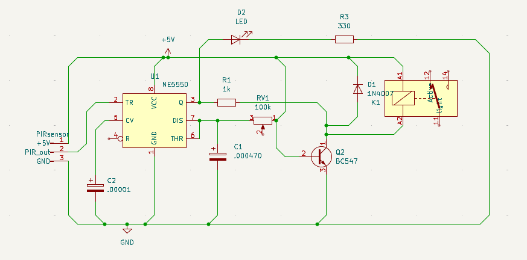

# Motion Detector Using PIR Sensor

Automatic Room Lighting and Load Control System using PIR Sensor, NE555 Timer IC, BC547 Transistor, and Relay.

## 📌 Project Overview

This project is a hardware-based motion detection and automatic load control system designed using basic electronic components. It detects human motion using a PIR sensor and automatically switches ON a connected load such as a room light or fan. After a preset delay, the load switches OFF automatically when no further motion is detected.

This project was developed as part of the **Applied Electronics Assignment** for Semester IV.

---

## 🎯 Objectives

- Detect human motion using a PIR sensor
- Automatically switch ON a connected load
- Keep the load ON for a preset delay period
- Switch OFF the load automatically after timeout
- Demonstrate practical use of:
  - PIR sensor
  - NE555 Timer IC in monostable mode
  - BC547 transistor as a switch
  - Relay-based load control

---

## 🧰 Components Used

| Component | Quantity |
|----------|----------|
| PIR Sensor (HC-SR501) | 1 |
| NE555 Timer IC | 1 |
| BC547 Transistor | 1 |
| 5V Relay | 1 |
| 100K Potentiometer | 1 |
| 470µF Capacitor | 1 |
| 10K Resistor | 1 |
| 1K Resistor | 1 |
| LED | 1 |
| Breadboard | 1 |
| Jumper Wires | As required |
| 5V Power Supply | 1 |

---

## ⚙️ Working Principle

1. The PIR sensor detects motion and outputs a HIGH signal.
2. The NE555 Timer IC, configured in monostable mode, generates a time-delayed output pulse.
3. The output of the 555 timer drives the BC547 transistor.
4. The transistor energizes the relay.
5. The relay switches ON the connected load.
6. After the preset time delay, the relay turns OFF automatically.

---

## 📄 Documentation

- [Project Summary](docs/project-summary.md)
- [Full Project Report](docs/Motion_Detector_PIR_Report.pdf)
- [Components List](hardware/components-list.md)
- [Circuit Connections](hardware/circuit-connections.md)
- [Timing Calculation](hardware/timing-calculation.md)
- [Troubleshooting Guide](hardware/troubleshooting.md)

## 🔌 How to Build

1. Connect the PIR sensor to the 5V supply and 555 timer trigger input.
2. Configure the 555 timer in monostable mode.
3. Connect the output of the 555 timer to BC547 transistor through 10K resistor.
4. Connect the transistor to the relay coil.
5. Connect the load through relay NO and C terminals.
6. Power the circuit and allow PIR sensor to stabilize.
7. Move in front of the sensor to test operation.
## ⏱️ Timing Formula

The output ON time of the 555 timer in monostable mode is given by:

## 📷 Project Images

### Circuit Diagram


### Breadboard Setup


### GPB setup


```text
T = 1.1 × R × C
